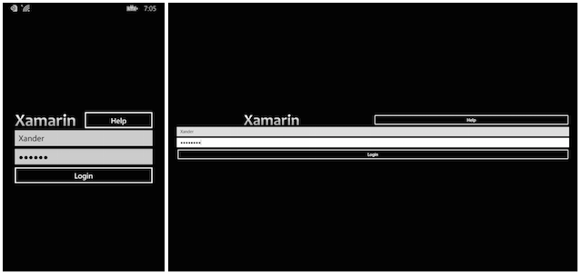
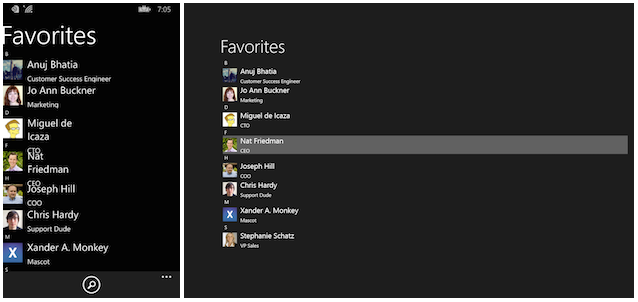
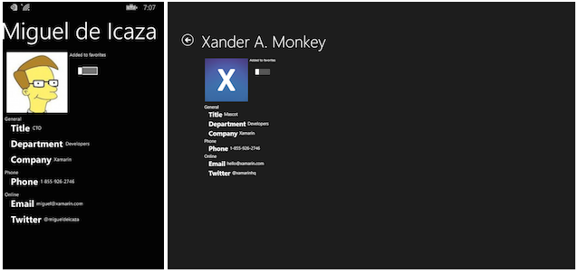

Employee Directory (Windows)
==========

Windows and Windows Phone versions for the [Windows PREVIEW](http://developer.xamarin.com/guides/cross-platform/xamarin-forms/windows/).

Notes
-----

This contacts application is Xamarin.Forms port of the [existing pre-build app](http://xamarin.com/prebuilt/employeedirectory). 
With Xamarin.Forms you can use C# or XAML to create layout and this sample app shows how to use both of them. To switch between user interface implementations open  ~/EmployeeDirectory/EmployeeDirectoryUI/App.cs file and change `uiImplementation` variable. 

Switch to XAML:

    public static class App
    {
        //Change the following line to switch between XAML and C# versions
        private static UIImplementation uiImplementation = UIImplementation.Xaml;
        ...
    }
    
Switch to C#:

    public static class App
    {
        //Change the following line to switch between XAML and C# versions
        private static UIImplementation uiImplementation = UIImplementation.CSharp;
        ...
    }

Nugets used in this solution: [PCLStorage][pclHref],
[Xamarin.Forms][xFormsHref],
[Microsoft.Bcl][mBclHref], 
[Microsoft.Bcl.Build][mBclBuildHref], 
[Microsoft.Net.Http][mNetHttpHref]

Components used in this solution: [Xamarin.Social][xSocialHref]

Authors
---------

Original: Jonathan Peppers, Bryan Phillips, Frank Krueger, James Clancey, Zack Gramana

Xamarin.Forms: Oleg Demchenko, Craig Dunn

[pclHref]: http://www.nuget.org/packages/PCLStorage/0.9.3
[xFormsHref]: http://xamarin.com/forms
[mBclHref]: https://www.nuget.org/packages/Microsoft.Bcl/1.1.8
[mBclBuildHref]: http://www.nuget.org/packages/Microsoft.Bcl.Build/1.0.14
[mNetHttpHref]: https://www.nuget.org/packages/Microsoft.Net.Http/2.2.22
[xSocialHref]: http://components.xamarin.com/view/xamarin.social